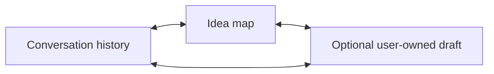
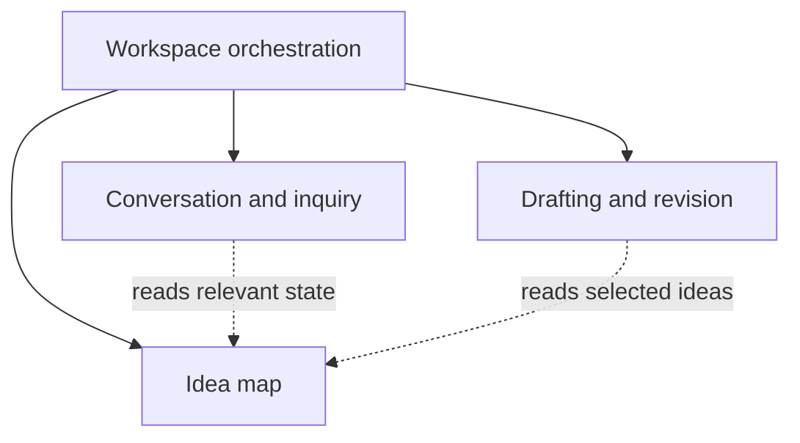
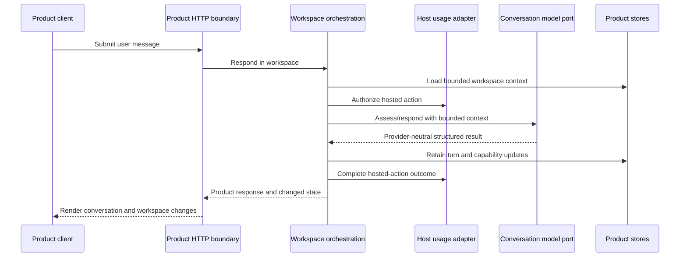

# Architecture: ThoughtForm

## Status and authority

This document is the canonical product-specific architecture for ThoughtForm. It
sits beneath the repository-wide rules in `AGENTS.md`, `docs/architecture.md`,
and `docs/decisions.md`. If they conflict, the repository-wide rules take
precedence until an explicit decision changes them.

The product brief defines what the product should be. This document defines the
durable technical boundaries through which that product should develop. Task
proposals still own concrete implementation scope, file changes, contracts, and
validation. This document is not approval to implement future behaviour.

`docs/products/thoughtform/terminology.md` is the canonical naming reference
for the concepts defined by this architecture. It clarifies their grammatical
and code-level distinctions without changing these boundaries.

The architecture deliberately describes both a small baseline and a richer
direction. The baseline must not collapse capability boundaries in ways that make
the intended product difficult to develop later.

## Architectural goals

- Keep the user authoritative over meaning, direction, and draft content.
- Make user-established idea material visible and correctable while keeping
  qualitative assistant assessment limited and negotiable.
- Support exploration, organisation, and expression without making a Draft or a
  completion state mandatory.
- Support fluid movement between discovery and composition once a draft exists.
- Let conversation and interface actions participate in one collaboration model.
- Keep conversation history, the idea map, and the draft distinct.
- Allow conversation, idea mapping, and drafting to develop independently behind
  product-owned contracts.
- Preserve ephemeral demo writing and durable owner writing without giving them
  different product semantics.
- Keep provider, auth, database, usage, and public-website infrastructure outside
  the product package.
- Deliver new behaviour as observable vertical slices rather than disconnected
  technical layers.

## Non-goals

- A generic workflow engine, event bus, event-sourced platform, or universal AI
  agent framework.
- A single state object that every module can mutate.
- Treating model judgments as deterministic truth.
- Making every future interaction or schema field part of the first baseline.
- Encoding client layout or a final visual design in domain contracts.
- Output-format selection, preference learning, inferred user profiles, or
  mandatory writing rules.
- Making ThoughtForm responsible for export, site-level publishing, auth,
  billing, or provider implementations.

## Source organisation

The product's source tree makes its architectural roles explicit:

```txt
thoughtform/
├── shared/                 product vocabulary and contracts
├── client/                 pages, workspace interface, routes, and UI actions
├── server/
│   ├── capabilities/       conversation, Idea Map, and drafting rules
│   ├── application/        complete operations coordinating capabilities
│   └── delivery/           inbound HTTP translation
└── testing/
    ├── fakes/              deterministic external substitutes
    ├── fixtures/           reusable product states
    ├── browser/            complete user journeys
    └── evaluations/        real-model behavioural checks
```

Ports live inside the capability that owns the need. Concrete AI and temporary
persistence adapters live with the API host; durable Prisma adapters live with
the database package. Tests of one behaviour remain beside that behaviour, but
production code never imports test support.

## Core workspace model

A workspace is the private body of work in which the user explores, organises,
and may express their current understanding. Discovery can occur with only
conversation and the idea map. Composition occurs only when an optional Draft is
created or developed. The workspace connects three representations without
merging them:



### Conversation history

The ordered record of what the user and assistant actually said. It preserves the
path of inquiry and remains distinct from derived interpretations. Conversation
messages do not double as draft versions or idea records.

### Idea map

The evolving, inspectable record of ideas established through the user's
exploration: their concise titles, shared syntheses, richer substance,
relationships, tensions, unresolved
questions, contextual importance, exploration, intended roles, and dispositions.

An idea's synthesis distils its current shape for inspection. Its substance is
the higher-resolution, lightly curated body uncovered through exploration and may
contain several paragraphs of distinctions, experiences, examples, tensions,
perspectives, counterarguments, uncertainties, and useful language. One deeply
explored idea may supply an entire articulation, and its substance may retain far
more than an optional Draft uses.

The map may retain explicit user interpretation and limited qualitative
assistant assessments of exploration and contextual importance. Assistant
hypotheses remain transient unless the user adopts, confirms, corrects, or
meaningfully develops them. The map is derived and correctable, but it is product
state rather than transient presentation data.

### Draft

The user's optional canonical first-person expression of their current
understanding. A Draft can be composed from selected user-established workspace
material and then changed freely by the user. It need not contain every important
or well-explored idea, resolve uncertainty, follow a conventional document form,
or exist for the workspace to be useful.

### Discovery and composition

Discovery and composition are activities, not exclusive workspace modes:

- **Discovery** finds out what the user thinks, including language that clarifies
  what they mean before a draft exists.
- **Composition** creates and continually develops the canonical draft from
  selected ideas.

**Articulation** describes the product outcome and value: the user's current
understanding expressed coherently in their own first-person words. It is not a
third activity, stored state, completion threshold, or command. Composition is
the accurate internal activity that creates or develops the optional Draft in
which an articulation can be inspected and recognised.

A composition request or accepted offer creates the first draft and begins
composition. Before that operation, reflection, paraphrasing, and finding words
remain discovery. Once a draft exists, composition may expose an unresolved idea
and return the work to discovery; later discovery may change the draft.

Activity classifies the primary purpose of a particular interaction or operation.
It is not persisted as a global mode that governs what the workspace may do next.
Drafting may reveal an unresolved idea; later inquiry may change an existing
draft.

An assistant move describes the technique used in one assistant response.
Clarification and reflection can uncover uncertain meaning or improve its
expression during discovery. An activity can also occur without an assistant
move, as when the user directly edits or restructures the draft during
composition.

Do not introduce an additional activity-focus taxonomy. More specific acts such
as clarifying, reflecting, structuring, composing, and revising belong in
assistant moves, user commands, or resource operations as appropriate.

Readiness is an assistant assessment about a particular possible action, not a
phase. User intention remains separate and may proceed despite that assessment.
Lifecycle is derived from resources that actually exist, such as a private
Draft, rather than stored in a general conversation-phase enum. Draft existence
does not imply that the workspace is complete or “done.”

A successful changed save or restoration also creates a revision-bounded
workspace event. Drafting deterministically suppresses only obvious textual
maintenance, then asks its saved-change interpretation port to classify and
respond to remaining changes. The save response is returned before that model
work begins. The follow-up operation revalidates the exact current
`DraftChange`, retains an assistant-only provisional response without inventing
a user utterance, and may add inspectable potential conflicts. Failure leaves
the saved revision intact and returns the exact current change for ordinary
conversation recovery.

Potential conflicts record known uncertainty where established material appears
incompatible; open questions record material that is not yet established. A
potential conflict may be within one idea, between ideas, or between established
substance and a saved edit. Conversation may remove it only after the user
resolves or dismisses it, and any established resolution remains ordinary idea
substance in the user's latest language.

## Authority and invariants

The following rules are architectural invariants:

1. The user is authoritative about intended meaning and desired direction.
2. A direct user edit becomes canonical draft content immediately after a
   successful save.
3. Assistant draft changes remain proposals until explicitly accepted.
4. Accepting a proposal must apply the reviewed proposal, not silently regenerate
   a different change.
5. Conversation history records what occurred; derived idea syntheses and
   substance may evolve.
6. Canonical idea material is grounded in user-expressed or user-adopted material;
   transient assistant hypotheses do not become map state merely because they
   informed a conversational move.
7. Assistant exploration and contextual-importance assessments are qualitative,
   not objective completion values, and may differ from user intention without
   either being silently overwritten.
8. A dismissed or parked idea remains available as historical context but should
   not be made active again without new evidence and appropriate user involvement.
9. Demo and owner work use the same product concepts even when their persistence
   adapters differ.
10. Public-website delivery is a later host concern and is not a product command
    or part of the Draft lifecycle.
11. Activity describes the primary purpose of an interaction or operation, while
    a move describes the assistant's technique; neither is a workspace phase.
12. Readiness is action-specific and advisory, while lifecycle is derived from
    real resources.
13. A saved-edit interpretation is provisional; neither its wording nor a
    potential conflict becomes established idea substance without subsequent
    user confirmation, clarification, or elaboration.
14. Creating a Draft is optional. Its absence is not product failure,
    incompletion, or evidence that discovery should continue.
15. A composed Draft is the user's first-person expression, not an assistant
    report, diagnosis, or authoritative explanation of the user.

## Capability architecture

The product is organised around three capabilities. A capability owns its domain
meaning and operations; workspace orchestration coordinates them.



Dashed relationships represent data supplied through orchestration or narrow
queries, not permission for one module to mutate another module's state directly.

### Conversation and inquiry

Owns:

- selecting the next conversational move;
- producing a concise question, reflection, explanation, or draft-focused
  response;
- following explicit user direction about focus and desired assistance;
- classifying the primary purpose of an interaction as discovery or, when a
  draft exists or is being created, composition;
- choosing an assistant move that serves that purpose;
- interpreting conversational commands into product intentions;
- consuming a prepared view of relevant workspace context.

Does not own:

- canonical idea-map state;
- draft content or proposal application;
- provider calls or provider-specific response formats;
- auth, access level, usage authorization, or persistence adapters.

Baseline direction:

- one useful question or concise reflection at a time;
- meaningful moves rather than a fixed `probe` response;
- explicit user redirection;
- structured, validated results sufficient for orchestration.

Later direction:

- context-sensitive inquiry style;
- calibrated challenge and perspective-taking;
- better handling of ambiguity, contradiction, examples, and silence;
- explanations of why a line of inquiry appears important.

Suggested replies are not part of the current product contract or baseline. They
may be reconsidered only if observed use shows that people need more help steering
the conversation. If introduced, they must express direction, selection,
confirmation, or authorisation only. They must never suggest substantive
answers, feelings, claims, interpretations, examples, or language that could be
mistaken for the user's own discovered idea material.

### Idea map

Owns:

- idea identity, concise title, current shared synthesis, and richer substance;
- relationships, tensions, dependencies, and grounded unresolved questions;
- assistant-perceived contextual importance and exploration;
- user-assigned importance, desired depth, and intended role;
- dispositions such as active, focused, satisfied, parked, dismissed, or separate;
- correction and reconciliation operations;
- provenance needed to distinguish user-established material from transient
  assistant reasoning.

Exploration and contextual importance are independent. Contextual importance asks
how much explanatory, emotional, argumentative, or structural weight an idea
appears to carry in this workspace. Exploration asks how fully it appears to have
been understood or expressed for its intended role.

Neither is an objective percentage. The client may use relative visual weight,
but contracts should retain qualitative meaning and the source of the judgment.

An idea may contain:

- a concise title and negotiated/shared synthesis;
- higher-resolution, lightly curated substance accumulated through exploration;
- current qualitative assistant exploration and contextual-importance assessments;
- an explicit user assessment or intention;
- known disagreement between user intention and qualitative assessment;
- unresolved questions;
- evidence references to conversation turns or draft regions;
- a prospective structural role and inclusion intention.

Baseline direction:

- a bounded list of identified ideas;
- expandable syntheses with richer substance available for inspection;
- qualitative exploration and importance;
- focus, satisfy, park, dismiss, correct, and reopen operations;
- assistant responses that respect those operations.

Later direction:

- typed relationships and dependencies;
- richer comparison of user intention with qualitative assistant assessment;
- structural roles, inclusion intentions, and separate-piece candidates;
- explainable assessment evidence;
- permission-aware re-emergence of parked material;
- spatial or weighted representations where they aid understanding.

### Drafting and revision

Owns:

- canonical private draft content;
- draft revision identity or concurrency token;
- direct user edits;
- composition requests and the selected source material they use;
- assistant revision proposals, including scope and base revision;
- proposal acceptance, rejection, amendment, and application;
- draft-specific provenance required for safe collaboration.

An assistant proposal should identify its scope, intended effect, proposed
content, and the draft revision against which it was prepared. It must not mutate
the draft by being generated.

Baseline direction:

- compose a private draft from agreed-enough workspace material;
- allow an intentionally early or rough draft when the user requests one;
- permit unrestricted direct editing;
- propose one bounded revision;
- accept, reject, or amend that proposal before application.

Later direction:

- phrase, passage, section, structural, and whole-draft scopes;
- selective or partial acceptance;
- alternative structures;
- passage-linked conversation;
- revision provenance and restoration;
- explicit return to discovery when prose exposes a gap.

### Workspace orchestration

Owns coordination rather than capability logic:

- loading the workspace state required for an operation;
- applying access and usage decisions supplied by the host at the correct boundary;
- invoking capability operations in an explicit order;
- preparing bounded model context;
- committing related state changes consistently;
- returning a coherent product result to the HTTP layer.

It must not become a bag of idea, draft, and conversation rules. Those rules
remain with their capabilities. It also must not expose generic database or model
primitives to product code.

The baseline should create only the operations exercised by real behaviours.
There is no requirement for a generic event bus, event sourcing, or a universal
event table.

## Commands, events, and state changes

A **command** expresses user intent or a requested product operation. An **event**
describes a meaningful result that occurred. These words describe product
semantics; they do not prescribe infrastructure.

Candidate commands include:

- submit a conversation message;
- focus, satisfy, park, dismiss, reopen, or correct an idea;
- request exploration or composition;
- request draft composition;
- save a manual draft edit;
- request, accept, reject, or amend a revision proposal.

Activity and move are not interchangeable command fields. Activity describes why
an operation is happening. A move exists only when the assistant contributes a
response and describes how it contributes. Their relationship is many-to-many.

Candidate resulting events include:

- conversation turn retained;
- idea identified or assessment changed;
- user idea intention changed;
- draft composed or manually revised;
- proposal created, accepted, rejected, amended, applied, or made stale.

Equivalent conversational and interface commands should call the same product
operation. They may produce different presentation responses, but they must not
create separate semantics.

For example, “that is not important” and clicking dismiss should both invoke the
idea-map dismissal operation. Conversation interpretation may first need to
identify which idea the user means; the explicit UI command already supplies it.

## State ownership

| State | Canonical owner | Mutable by | Derived or canonical |
|---|---|---|---|
| Conversation messages | Conversation store | Retained turn operation | Canonical history |
| Idea synthesis and substance | Idea map | Idea-map operations | Derived, correctable product state |
| Assistant idea assessment | Idea map | Assessment operation | Derived interpretation |
| User idea intention | Idea map | Explicit user command | Canonical user intent |
| Draft content | Draft | Direct edit or accepted proposal | Canonical user-owned content |
| Revision proposal | Draft | Proposal lifecycle operations | Proposed, never canonical by itself |
| Usage metadata | Host usage system | Hosted model attempt lifecycle | Operational metadata |

Activity is interaction metadata rather than canonical workspace state. A move is
assistant-response metadata. Neither belongs in a stored workspace lifecycle
field. Readiness may be retained as a current assistant assessment where useful,
but it must identify the action being assessed and must not block an explicit user
command by itself.

Derived does not mean disposable. Idea assessments, syntheses, and substance may
need to be retained so the workspace remains coherent, but they remain revisable
interpretations rather than historical facts.

## Principal flows

### Conversation turn



Exact transaction boundaries will depend on persistence design. A generated
response must not be reported as retained if the relevant temporary workspace has
expired or a durable write fails.

### Idea action

1. The client or conversation interpreter issues a product-language idea command.
2. Workspace orchestration invokes the idea-map operation.
3. The operation records the user's intention without rewriting the assistant's
   assessment merely to force agreement.
4. Conversation orchestration decides whether an immediate response adds value.
5. Later model context includes the current disposition and any meaningful
   disagreement.

### Draft composition

1. The user requests composition or accepts an offer to compose.
2. Drafting receives selected ideas, syntheses, relevant substance, user
   intentions, unresolved uncertainty, and relevant conversation language.
3. Usage authorization occurs immediately before the hosted model boundary.
4. The model returns provider-neutral draft content and metadata.
5. A new private draft is retained as canonical content only if the workspace is
   still available and the save succeeds.
6. The client displays an editable draft; composition does not end inquiry.

### Assistant revision

1. The user requests a change with an explicit or clarified scope.
2. The model prepares a proposal against a known draft revision.
3. The proposal is displayed without mutating canonical content.
4. Acceptance verifies that the base draft revision is still current.
5. If it is current, the reviewed proposal is applied atomically.
6. If it is stale, the product preserves the user's newer draft and asks for an
   explicit rebase, regeneration, or dismissal.

### Manual draft edit

1. The user saves edited content against a known draft revision.
2. The draft operation validates the revision and commits the user's content.
3. The change is classified conservatively as textual maintenance,
   composition, conceptual change, or structural change where possible.
4. Meaningful change information may be offered to the idea map for provisional,
   inspectable interpretation.
5. Conversation orchestration responds only when useful or explicitly requested.

Every successful save changes canonical draft content. Classification failure
must not prevent the user from editing their own draft.

## AI architecture

The product owns task-specific model ports. The host supplies adapters backed by
`packages/ai`. Product code must not import provider SDKs, provider configuration,
or provider-specific usage types.

Different model-backed responsibilities may eventually require distinct ports or
operations:

- conversational response generation;
- structured idea/readiness assessment;
- draft composition;
- bounded revision proposal generation;
- substantive-edit interpretation.

Do not force all responsibilities through one permanent unstructured chat call.
Also do not create all ports before a behaviour needs them. Each task should
decide whether assessment and generation can safely share a call based on
validation, cost, latency, failure, and testability.

Model outputs that change product state must be validated into product-owned
types. Invalid structured output should fail safely or degrade to conversation
without corrupting retained state.

Context assembly belongs in product server code because relevance is product
meaning. Provider formatting and token accounting belong in the host AI adapter.
Context should be bounded and purpose-specific rather than automatically sending
every stored artifact to every model operation.

## Package and dependency boundaries

Product-specific contracts and behaviour remain under:

```txt
packages/products/src/thoughtform/
  shared/
  server/
  client/
```

As capabilities are implemented, focused submodules may be introduced under
those runtime boundaries for workspace, conversation, idea map, and drafts.
Concrete file structure belongs to task proposals; it should express these
responsibilities rather than invent a second architectural pattern.

Dependency direction:

- Product client depends on product shared contracts and host-provided navigation
  and request adapters.
- Product HTTP code parses product requests and delegates to product orchestration.
- Product orchestration depends on product capability services and product-owned
  ports.
- Host API composition supplies authenticated context and concrete adapters.
- `packages/db` supplies persistence mechanisms behind product-owned ports.
- `packages/ai` supplies provider mechanisms behind product-owned model ports.
- `packages/auth` and host API code determine identity and access level.
- `packages/shared` contains only genuinely platform-wide contracts.

All imports follow the repository's repo-root absolute import rule.

## Client and API responsibilities

The product client owns:

- rendering conversation, idea map, draft, and proposal state;
- capturing messages, explicit idea actions, edits, and approvals;
- accessible interaction and focus behaviour;
- local unsaved-edit state;
- presenting authoritative server outcomes and recoverable conflicts;
- copy/download operations that do not require server persistence.

The client must not decide assistant moves, readiness, access, usage eligibility,
or whether an assistant proposal is safe to apply to a newer draft.

The product server owns:

- product command validation and orchestration;
- assistant policy and structured model interpretation;
- capability state transitions;
- persistence meaning;
- proposal concurrency checks;
- product failure codes.

The host API owns authentication, access context, adapter selection,
configuration, hosted-AI safety, and infrastructure failures. API routes remain
thin and server authorization remains authoritative.

## Persistence architecture

Product ports use product language such as loading a workspace, retaining a
conversation turn, changing an idea disposition, or saving a draft revision.
They must not expose generic queries or transactions.

### Demo workspaces

- Conversation, idea map, draft, and proposals are temporary.
- Writing content is not durably persisted server-side.
- Current application-memory expiry and cleanup semantics remain authoritative
  until a later approved task changes them.
- Process loss may remove the workspace sooner than its visible deadline.
- Operational access and usage metadata may persist under the documented privacy
  boundary.
- Retained plain text remains readable and copyable without introducing a
  product export contract.

### Owner workspaces

- Conversations, idea maps, and private drafts may be durable.
- Every durable read and write is owner-scoped in the persistence operation.
- Product ports define the required consistency; `packages/db` implements it with
  schema, transactions, and repositories.
- Later public content delivery is owned by the host website and does not mutate
  or publish a product Draft.

## Concurrency and consistency

The architecture must protect user authorship under overlapping requests:

- Conversation turns require stable ordering and must not report unretained model
  output as successful.
- Direct draft saves should use an expected revision/version to detect stale
  clients.
- Proposals are tied to a base draft revision and become stale rather than
  overwriting newer manual work.
- Applying a proposal and advancing the draft revision should be atomic.
- Repeated acceptance, completion, or retry operations should be idempotent where
  network retries could duplicate effects.
- Related idea-map changes should use a defined expected version or merge policy
  once concurrent UI and conversation updates become possible.
- Hosted usage reservation occurs immediately before model invocation and is
  completed with the observable outcome even if later retention fails.

Task proposals should state their transaction and conflict behaviour when they
introduce a mutable resource.

## Failure and degraded-state behaviour

Failures should preserve the user's current work whenever possible.

- Invalid input fails before model use or persistence changes.
- Hosted AI disabled or limited leaves retained conversation and draft state
  available for reading, copying, editing, or clearing.
- Invalid model assessment must not corrupt the idea map or draft.
- A stale draft proposal must never overwrite newer user edits.
- Temporary workspace loss returns a stable unavailable state and clears stale
  client identity safely.
- Persistence failure must distinguish “generated but not retained” from success.
- Optional assistant commentary on an edit may fail without rolling back the
  user's successful edit.

HTTP failures should be stable product codes with concise user-facing messages;
provider details, internal budget totals, and other users' state remain private.

## Privacy and data minimisation

- Demo writing remains temporary and isolated by authenticated user.
- Model context contains only material relevant to the requested operation.
- Usage records contain operational metadata, never prompts, messages, drafts,
  generated prose, IP addresses, or user-agent strings.
- OpenAI provider configuration, when explicitly selected, continues to use `store: false` without
  overstating provider retention guarantees.
- Research remains separate and should not be introduced into ordinary model
  context without an approved product task and privacy review.

## Testing architecture

Prefer observable behaviour and public contracts over internal implementation
details.

Each capability should have:

- domain tests for state transitions and invariants;
- contract tests for model and persistence ports;
- orchestration tests for ordering, failures, and cross-capability effects;
- HTTP tests for validation, authorization, and stable failure mapping;
- client tests for rendered states and accessible interaction;
- host composition tests proving the correct adapters and access context are used.

Representative scenario tests should cover:

- guided discovery from a vague thought;
- user-led composition from a strong initial view;
- disagreement between user intention and qualitative assistant assessment;
- dismissal through conversation and through the UI producing equivalent state;
- drafting with acknowledged unresolved uncertainty;
- a manual edit revealing a discovery gap;
- an assistant proposal becoming stale after a user edit;
- a useful conversation and idea map without any Draft;
- a first-person articulation corrected until the user recognises it as faithful;
- demo expiry or hosted limits preserving recoverable local work.

Model-dependent judgment needs curated evaluation examples in addition to unit
tests. Live-provider calls should not be required by the normal test suite.

## Evolution rules

- Extend a capability internally when richer behaviour preserves its existing
  responsibility.
- Add or refine a product-owned operation when another capability needs new
  information; do not reach into internal state.
- Add durable schema only for behaviour being implemented.
- Keep baseline contracts capable of representing later richness, but do not fill
  them with unused optional fields.
- Record a decision when implementation settles an architectural question.
- Update this document when ownership, dependency direction, canonical state, or
  a cross-capability invariant changes.
- Deliver work as vertical slices through these boundaries. A valid slice might
  identify one idea, render its synthesis, allow dismissal through either surface,
  and ensure later assistant behaviour respects that dismissal.
- Do not reintroduce a general conversation phase or an activity-focus hierarchy.
  Add concrete commands, moves, readiness targets, and resource state only when a
  real behaviour needs them.

## Baseline sequence

The completed and proposed product sequence is:

1. Immediate hosted-AI safety boundaries.
2. Workspace and capability foundations.
3. Idea-map baseline.
4. Meaningful discovery and composition readiness.
5. Private drafts and approved revision proposals.
6. Manual draft-edit interpretation.
7. Conversational-thinking course correction.
8. Draft Format removal.
9. Conversational-thinking experience alignment.
10. Complete temporary demo session.
11. Calibrated usage limits and cost protection.
12. Admin visibility and release readiness.

Preference learning and product-owned export or publishing are not in the
product sequence. After product v1 is ready for release, the host website may
separately implement local Markdown ingestion and static public content pages.

Each task remains independently proposed and requires approval.

## Open decisions and decision points

These questions remain open intentionally:

- **Idea-map evidence:** reassess provisional idea-count limits after sustained
  complete-product use and consider privacy-reviewed, content-free product
  analytics before changing them.
- **Idea evolution:** implement autonomous, user-correctable merge and split
  behaviour after stronger conversational interpretation exists and before the
  editor is considered fully functional.
- **Substantive edit detection:** begin conservatively during manual-edit work;
  decide whether explicit user action, deterministic diff rules, model
  classification, or a combination best protects flow and privacy.
- **Assistant response to UI actions:** revisit acknowledgement wording and
  placement through browser use after the idea-map baseline is implemented.
- **Multi-user collaboration:** treat shared workspaces as a future direction;
  real-time transport does not replace revisions, conflict handling, permissions,
  attribution, or collaborative editing semantics.
- **Proposal comparison:** decide during draft work how change scope, diffing,
  amendment, and accessible acceptance are represented.
- **Temporary state location:** retain current application-memory semantics until
  a complete-demo task establishes whether any browser-held state improves
  privacy and resilience without fragmenting canonical workspace state.
- **Context growth:** decide with real prompts and measured sessions how older
  conversation, idea syntheses and substance, and draft content are selected or
  summarized under hard input bounds.

The distinction between activity, move, readiness, user intention, and
resource-derived lifecycle is settled architecture rather than an open decision.

An open decision should be resolved in the first approved task where it affects an
observable behaviour, durable contract, security property, or data lifecycle.
